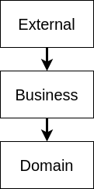

# Motivation

## General Setup

In the enterprise world out there, it is quite common to have the following architectural structure or a permutation of it:



This is done to have a low technical complexity to achieve high maintainability and long living product. If you now use Spring Boot or any JEE server, you can call yourself a business developer.

Jokes aside, there is one issue with this: Tests. How are you supposed to test?

For our example let's imagine that there is a **kafka listener**, calling an **EntityMaintenanceService**, and a lot of repositories connecting the entities to the database.

## So, about the tests

Are you running unit tests, totally isolated with mocks and validating technical aspects? That is valid, however not the scope of what you normally want to assert. You want to make sure that the application does what the product owner defined.

For that we can use integration tests and this has multiple different advantages. Just to name a few: 

 - verify that kafka integration works
 - verify that the messages can be serialized and deserialized 
 - make sure what happens in the real production works 
 - verify that the application context starts correctly

I guess you can find a lot more. The "only" real disadvantage is, the time they take. Instead of finishing in near milliseconds, they take a lot longer, up to half a minute or more if you have a big project.

However, this also opens up a new issue: How do we actually test asynchronous processes which are quite common?

Let us imagine the following test:

```kotlin
@SpringBootIntegrationTest // Has Embedded Kafka, Database, ...
class ExampleIntegrationTest {
    
    @Autowired
    lateinit var kafkaTemplate: KafkaTemplate<String, Message>
    
    @Test
    fun `test that the workflow does what it is supposed to do`() {
        // Arrange
        val createMessage = CreateSomethingMessage(/* data */)
        val updateMessage = UpdateSomethingMessage(/* data */)
        
        // Act
        kafkaTemplate.sendDefault(createMessage).get()
        kafkaTemplate.sendDefault(updateMessage).get()
        
        // Assert
        // ????
    }
}
```

Quite straight forward, ain't it? We emulate a message being send by something through kafka. But the asserts are now very interesting.

How do you assert this now?

The first idea would be, to fetch the updated entity from the database and verify it has changed. Like this for example:

```kotlin
@SpringBootIntegrationTest // Has Embedded Kafka, Database, ...
class ExampleIntegrationTest {

    @Autowired
    lateinit var kafkaTemplate: KafkaTemplate<String, Message>

    @Autowired
    lateinit var entityRepository: EntityRepository

    @Test
    fun `test that the workflow does what it is supposed to do`() {
        // Arrange
        val createMessage = CreateSomethingMessage(/* data */)
        val updateMessage = UpdateSomethingMessage(/* data */)

        // Act
        kafkaTemplate.sendDefault(createMessage).get()
        kafkaTemplate.sendDefault(updateMessage).get()

        // Assert
        val entityOptional = entityRepository.findById(/* id */)
        assertThat(entityOptional.isPresent)
            .withFailMessage("Entity was not created")
            .isTrue
        
        assertThat(entityOptional.get().version)
            .withFailMessage("Entity was not updated")
            .isEqualTo(2)
    }
}
```

So, we assert that the version is increased. Alright. So, if we run this test now, it fails with the message:

> Entity was not created

Why? Most of you will now that, but the KafkaTemplate send method is asynchronous. Even with the `.get()` call, we only ensure that the Kafka server has received the message.

So, at the point we call `entityRepository.findById`, the code we want to test has not been called yet.

## "Active" waiting approach

Dang, alright. Okay. So, just let us wait until the answer is there, right? Like this:

```kotlin
// Assert
val entity: Entity
while(true) {
    val entityOptional = entityRepository.findById(/* id */)
    if(entityOptional.isPresent) {
        entity = entityOptional.get()
        break
    }
}

assertThat(entityOptional.get().version)
    .withFailMessage("Entity was not updated")
    .isEqualTo(2)
```

**Dont.**

Seriously. Don't do this. Not only can we now not really verify that the trip has been created, we do [busy waiting](https://en.wikipedia.org/wiki/Busy_waiting), which is never ever, under any circumstance a good idea.

So, we could introduce more code. Let the Thread sleep for some time, break after n tries, there is a lot what you can do.

Instead of doing this manually, let's use [awaitility](https://github.com/awaitility/awaitility), because they already implemented that.

```kotlin
// Assert
await().atMost(5, SECONDS).until(entityRepository.findById(/* id */).isPresent)

val entityOptional = entityRepository.findById(/* id */).get()

assertThat(entityOptional.get().version)
    .withFailMessage("Entity was not updated")
    .isEqualTo(2)
```

Okay, great! 5 seconds should be enough, for sure. But, what does not happen?

Every x milliseconds the condition is tested and, if true, breaks the loop. So, in theory it is not busy waiting. One grain of salt still remains though.

We don't want to wait 5 Seconds all the time, this makes our tests extremely slow and we don't want that. It is infuriating to wait this long for results. So the polling interval is set to smaller increments.

Buuuut, what we have to keep in mind is that everytime we check the condition we make request against the DB! So the interval cannot be too small and not to big. But also also we have to make it a big bigger than the smallest possible value to compensate for concurrency issues and and and.

## Parking the test until the condition is met

Asynchronous code can be annoying some times. What would be great would be to park the test for a max amount of time and let the tested code continue the test. This has advantages:

 - No unwanted request and busy waiting
 - No resource sharing between the test and the tested class.
 - This setup can be reused

To achieve this, we will have to utilize Mocks and Spys though. To keep it simple for now let us use [mockk](https://github.com/mockk/mockk) and a spy around some service that, in our example

Let me show you an example.

```kotlin
@SpyKBean
lateinit var maintenanceService: EntityMaintenanceService

@Test
fun `test that the workflow does what it is supposed to do`() {
    // Arrange
    val createMessage = CreateSomethingMessage(/* data */)
    val updateMessage = UpdateSomethingMessage(/* data */)
    val future = CompletableFuture<Entity>()   // (1)
    every { maintenanceService.handleUpdate(any()) } answers {     // (2)
        val result = callOriginal()
        future.complete(future)
        result
    }

    // Act
    kafkaTemplate.sendDefault(createMessage)
    kafkaTemplate.sendDefault(updateMessage)

    // Assert 
    val entity = assertDoesNotThrow { future.get(5, TimeUnit.SECONDS) } // (3)

    assertThat(entity.version)
        .withFailMessage("Entity was not updated")
        .isEqualTo(2)
}
```

What happens here?

We utilize the completable future a (1). This will hold the result once the business case is finished. We then in (2) enhance our spy. When the spied upon service is called, we call the original method (so the real method) and complete the future with the result of the method. However, we still return the result, meaning the tested case can continue as normal.

Lastly, in the assert block (3), we then call `get` on the future, wrapping it in an `assertDoesNotThrow` block. Semantically speaking: If the exception is thrown, the method was not called in time.

> Important notice: we call it with 5 seconds maximum timout. We can also call it without that, but this might lead to a deadlock in our test, if the method is not called correctly!

If we only want to be notified once the code has finished, we can do it event simpler utilizing a [Semaphore](https://docs.oracle.com/javase/7/docs/api/java/util/concurrent/Semaphore.html). This simplifies the code even further, to release the sleeping test once the kafka consumer has finished, making it even cleaner.

```kotlin
// Arrange
val createMessage = CreateSomethingMessage(/* data */)
val updateMessage = UpdateSomethingMessage(/* data */)
val semaphore = Semaphore(0)
every { kafkaConsumer.consume(any()) } answers {     // (2)
    callOriginal()
    semaphore.release()
}

// Act
kafkaTemplate.sendDefault(createMessage)
kafkaTemplate.sendDefault(updateMessage)

// Assert 
assertDoesNotThrow { semaphore.tryAcquire(5, TimeUnit.SECONDS) } // (3)

assertThat(entity.version)
    .withFailMessage("Entity was not updated")
    .isEqualTo(2)
```

Since we start with 0 permits, only after the method has been called will acquire continue the thread.

## How does this now differ?

The main difference here is two thing:

- We do not need to know the inner workings of the code.    
  The only thing we need to know is the endpoint that is being called and probing it, continuing after the async code has finished.
- We don't put more pressure on the cpu.    
  Busy waiting is not great. Never. Active waiting is also not the best thing. Whenever our test tries to check the defined condition, we slow down or potentially stop the tested code, leading to instability in tests.

When defining the 5-second maximum amount of waiting for semaphores and futures, this looks the same as with awaitility, but it really is not.

When calling `semaphore.acquire` for example we park the thread that has called this method. If the thread is not woken up again after 5 seconds, it will be interrupted, leading to the exception and in this scenario signaling that the method was not called (or has not finished yet).

## So, this library:

> No more busy or active waiting and more stability in code, cool. But it is more code to write, ay? And it is more complicated, no?

You are right my friend! And for this reason, this library exist! With it you do the same behaviour (and a little bit more) like this:


```kotlin

@SpyKBean
lateinit var maintenanceService: EntityMaintenanceService

@Test
fun `test that the workflow does what it is supposed to do`() {
    // Arrange
    val createMessage = CreateSomethingMessage(/* data */)
    val updateMessage = UpdateSomethingMessage(/* data */)
    val barrier = barrier { kafkaConsumer.consume(any()) } // (1)

    // Act
    kafkaTemplate.sendDefault(createMessage)
    kafkaTemplate.sendDefault(updateMessage)

    // Assert 
    barrier.tryToTraverse() // (2)

    assertThat(entity.version)
        .withFailMessage("Entity was not updated")
        .isEqualTo(2)
}
```

This right here is the same as our example with the semaphore.

At (1) we construct a barrier, which encapsulates the Semaphore and at (2) we try to pass the barrier.

This also compensates for potential exceptions thrown and provides an optional mechanism to validate results of the barrier method.

If you need more fine granular power over what happens, you can use the `probe`, like this:

```kotlin
@SpyKBean
lateinit var maintenanceService: EntityMaintenanceService

@Test
fun `test that the workflow does what it is supposed to do`() {
    // Arrange
    val createMessage = CreateSomethingMessage(/* data */)
    val updateMessage = UpdateSomethingMessage(/* data */)
    val probe = probe { kafkaConsumer.consume(any()) }

    // Act
    kafkaTemplate.sendDefault(createMessage)
    kafkaTemplate.sendDefault(updateMessage)

    // Assert 
    val entity = probe.getResult()

    assertThat(entity.version)
        .withFailMessage("Entity was not updated")
        .isEqualTo(2)
}
```

`probe.getResult()` will wait, just like the future, and also compensate for exceptions thrown in the tested code.

## Finally

If you want to test asynchronous code, I encourage you to give this library a try. If you find any better/different approaches open an issue, create a pull request or do whatever to the code. It is totally open source and available to do what ever you want.